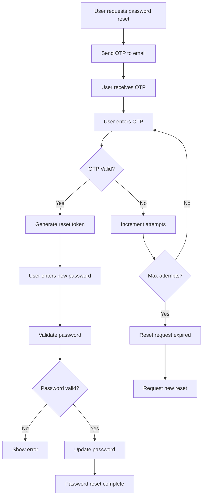

# Forgot Password System Documentation

## Overview
This system provides a secure password reset functionality using email OTP verification. Users can reset their passwords by receiving an OTP via email and following a secure verification process.

## Features
- ✅ Send password reset OTP to user's email
- ✅ Verify password reset OTP with attempt limiting (max 3 attempts)
- ✅ OTP expiration (15 minutes)
- ✅ Resend password reset OTP functionality
- ✅ Secure password reset with token validation
- ✅ Beautiful HTML email templates for password reset
- ✅ Development mode with OTP in response
- ✅ Password validation and security
- ✅ Clean and secure implementation

## API Endpoints

### 1. Forgot Password - Send OTP
**POST** `/api/user/forgot-password`

**Request Body:**
```json
{
  "email": "user@example.com"
}
```

**Response (Success):**
```json
{
  "success": true,
  "message": "Password reset OTP sent successfully to your email",
  "data": {
    "otp": "123456"  // Only in development mode
  }
}
```

**Response (Error):**
```json
{
  "success": false,
  "message": "No user found with this email address"
}
```

### 2. Verify Password Reset OTP
**POST** `/api/user/verify-password-reset-otp`

**Request Body:**
```json
{
  "email": "user@example.com",
  "otp": "123456"
}
```

**Response (Success):**
```json
{
  "success": true,
  "message": "OTP verified successfully! You can now reset your password.",
  "data": {
    "token": "reset_token_here"
  }
}
```

**Response (Error):**
```json
{
  "success": false,
  "message": "Invalid OTP. 2 attempts remaining."
}
```

### 3. Reset Password
**POST** `/api/user/reset-password`

**Request Body:**
```json
{
  "email": "user@example.com",
  "token": "reset_token_here",
  "newPassword": "newpassword123"
}
```

**Response (Success):**
```json
{
  "success": true,
  "message": "Password reset successfully! You can now login with your new password.",
  "data": {
    "id": "user_id",
    "fullName": "John Doe",
    "email": "user@example.com",
    "phoneNumber": "+1234567890",
    "emailVerified": true,
    "emailVerifiedAt": "2024-01-01T00:00:00.000Z"
  }
}
```

**Response (Error):**
```json
{
  "success": false,
  "message": "Password must be at least 6 characters long"
}
```

### 4. Resend Password Reset OTP
**POST** `/api/user/resend-password-reset-otp`

**Request Body:**
```json
{
  "email": "user@example.com"
}
```

**Response:** Same as forgot password endpoint

## Security Features

1. **OTP Expiration:** 15 minutes
2. **Attempt Limiting:** Maximum 3 attempts per OTP
3. **Token Validation:** Secure token-based password reset
4. **Rate Limiting:** Prevents spam by checking existing valid OTPs
5. **Email Validation:** Validates email format before sending
6. **Password Validation:** Minimum 6 characters required
7. **Secure Storage:** OTPs and tokens are stored securely
8. **Auto Cleanup:** Expired OTPs and tokens are automatically removed

## Password Reset Flow



## Usage Examples

### Frontend Integration

```javascript
// Step 1: Request password reset
const requestPasswordReset = async (email) => {
  const response = await fetch('/api/user/forgot-password', {
    method: 'POST',
    headers: { 'Content-Type': 'application/json' },
    body: JSON.stringify({ email })
  });
  return await response.json();
};

// Step 2: Verify OTP
const verifyPasswordResetOTP = async (email, otp) => {
  const response = await fetch('/api/user/verify-password-reset-otp', {
    method: 'POST',
    headers: { 'Content-Type': 'application/json' },
    body: JSON.stringify({ email, otp })
  });
  return await response.json();
};

// Step 3: Reset password
const resetPassword = async (email, token, newPassword) => {
  const response = await fetch('/api/user/reset-password', {
    method: 'POST',
    headers: { 'Content-Type': 'application/json' },
    body: JSON.stringify({ email, token, newPassword })
  });
  return await response.json();
};

// Complete flow example
const handlePasswordReset = async (email, otp, newPassword) => {
  try {
    // Step 1: Request reset
    const resetRequest = await requestPasswordReset(email);
    if (!resetRequest.success) {
      throw new Error(resetRequest.message);
    }

    // Step 2: Verify OTP (in real app, user would enter OTP from email)
    const otpVerification = await verifyPasswordResetOTP(email, otp);
    if (!otpVerification.success) {
      throw new Error(otpVerification.message);
    }

    // Step 3: Reset password
    const passwordReset = await resetPassword(email, otpVerification.data.token, newPassword);
    if (!passwordReset.success) {
      throw new Error(passwordReset.message);
    }

    console.log('Password reset successful!');
    return passwordReset;
  } catch (error) {
    console.error('Password reset failed:', error.message);
    throw error;
  }
};
```

### cURL Examples

```bash
# Step 1: Request password reset
curl -X POST http://localhost:3000/api/user/forgot-password \
  -H "Content-Type: application/json" \
  -d '{"email": "user@example.com"}'

# Step 2: Verify OTP
curl -X POST http://localhost:3000/api/user/verify-password-reset-otp \
  -H "Content-Type: application/json" \
  -d '{"email": "user@example.com", "otp": "123456"}'

# Step 3: Reset password
curl -X POST http://localhost:3000/api/user/reset-password \
  -H "Content-Type: application/json" \
  -d '{"email": "user@example.com", "token": "reset_token_here", "newPassword": "newpassword123"}'

# Resend OTP
curl -X POST http://localhost:3000/api/user/resend-password-reset-otp \
  -H "Content-Type: application/json" \
  -d '{"email": "user@example.com"}'
```

## Error Handling

The system handles various error scenarios:

- **Invalid email format**
- **User not found**
- **OTP expired**
- **Too many attempts**
- **Invalid OTP**
- **Invalid reset token**
- **Token expired**
- **Password too short**
- **SMTP configuration errors**

## Database Changes

The user model now includes:
- `passwordResetToken: string` - Secure token for password reset
- `passwordResetExpires: Date` - Token expiration timestamp

## Testing

1. **Start the server:**
   ```bash
   npm run dev
   ```

2. **Test the complete flow:**
   ```bash
   node test-forgot-password.js
   ```

3. **Manual testing:**
   ```bash
   # Register a user first
   curl -X POST http://localhost:3000/api/user/register \
     -H "Content-Type: application/json" \
     -d '{"fullName": "Test User", "phoneNumber": "+1234567890", "email": "test@example.com", "password": "password123"}'
   
   # Then test forgot password flow
   curl -X POST http://localhost:3000/api/user/forgot-password \
     -H "Content-Type: application/json" \
     -d '{"email": "test@example.com"}'
   ```

## Security Considerations

1. **Never log OTPs or tokens in production**
2. **Use secure SMTP credentials**
3. **Implement rate limiting at API level**
4. **Monitor for suspicious password reset activity**
5. **Regularly clean up expired tokens**
6. **Validate password strength**
7. **Use HTTPS in production**

## Development vs Production

### Development Mode
- OTP is included in API response for testing
- Detailed error messages
- Console logging enabled

### Production Mode
- OTP is never returned in API response
- Generic error messages for security
- Minimal logging

## Troubleshooting

### Common Issues

1. **"Failed to send password reset OTP"**
   - Check SMTP configuration
   - Verify email credentials
   - Check network connectivity

2. **"No user found with this email address"**
   - User must be registered first
   - Check email spelling

3. **"Password reset OTP has expired"**
   - OTP is valid for 15 minutes only
   - Request a new password reset

4. **"Too many failed attempts"**
   - User exceeded 3 attempts
   - Request a new password reset

5. **"Invalid password reset token"**
   - Token may be expired or invalid
   - Complete the OTP verification process again

6. **"Password must be at least 6 characters long"**
   - Ensure new password meets minimum requirements

## Support

For issues or questions, please check:
1. Environment configuration
2. SMTP provider settings
3. Network connectivity
4. User registration status
5. Token expiration times
